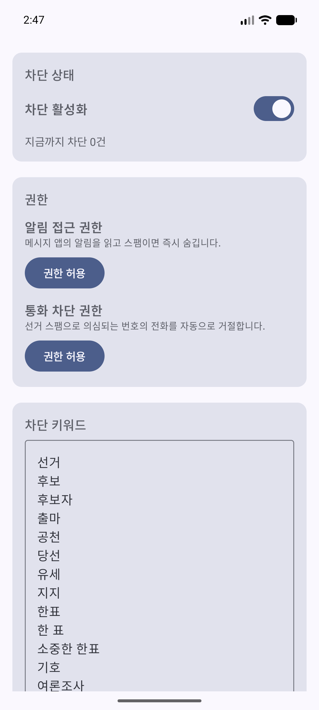
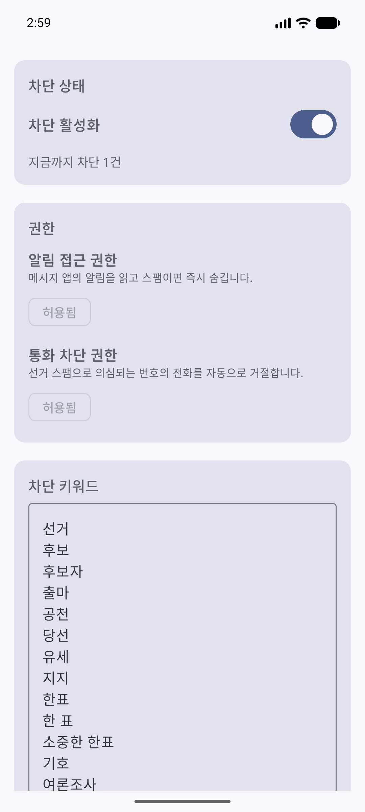
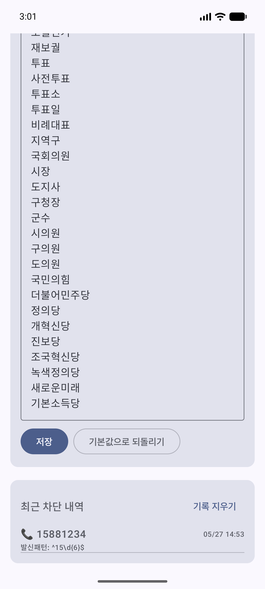

# 선거 스팸 차단 (SpamBlocker)

선거철에 쏟아지는 후보자 홍보 문자와 여론조사 메시지 알림을 자동으로 숨기는 안드로이드 앱.

- **알림 차단**: 메시지 앱의 스팸 알림을 즉시 숨김 (저장은 그대로, 알림만 안 뜸)
- **온디바이스**: 키워드 매칭이 모두 폰 안에서 처리, 외부 서버 없음
- **사용자 편집 가능**: 차단 키워드와 화이트리스트는 앱에서 직접 수정

> **현재 범위: 문자(SMS) 알림 차단 전용.** 통화 차단은 번호만으로 여론조사·선거 전화를 구분할 수 없어(15xx/16xx 대역은 은행·택배 등 정상 기업도 사용) 오탐 위험이 커서 제외했습니다. 통화는 사용자 거절 패턴을 학습하는 방식으로 차후(v2) 재검토 예정.

---

## 스크린샷

| 권한 부여 전 | 권한 부여 + 차단 1회 후 | 차단 로그 |
|---|---|---|
|  |  |  |

---

## 작동 원리

### 1. SMS 알림 차단 — `NotificationListenerService`
시스템에서 발급한 알림 접근 권한을 받아, 메시지 앱(`com.google.android.apps.messaging`, `com.samsung.android.messaging` 등)이 띄운 알림의 제목·본문을 읽고 키워드/발신번호 패턴에 매칭되면 `cancelNotification(key)` 으로 즉시 숨깁니다.

- 메시지 자체는 삭제하지 않음 (정책상 기본 SMS 앱이 아니면 불가능)
- 알림이 잠깐 떴다가 사라지는 게 아니라, 시스템이 알림을 등록하는 동시에 가로채서 사용자 인지 전에 제거

### 2. 필터 엔진
순수 Kotlin 라이브러리, Android 프레임워크 의존성 없음. 유닛 테스트로 검증.

- **키워드 매칭**: 발신자명 + 본문을 lowercase 후 부분 문자열 검사
- **화이트리스트**: 등록된 번호는 키워드와 무관하게 통과

---

## 기술 스택

| 항목 | 선택 |
|---|---|
| 언어 | Kotlin 2.2 |
| UI | Jetpack Compose (Material 3, BOM 2026.02) |
| 빌드 | Android Gradle Plugin 9.2.1 / Gradle 9.4 |
| compileSdk / minSdk | 36 / 29 |
| 저장소 | `SharedPreferences` + JSON 직렬화 |
| 상태 관리 | `StateFlow` + Compose `collectAsState` |
| 테스트 | JUnit 4 (유닛), Compose UI Test (예정) |

서버 없음. 외부 라이브러리는 AndroidX/Compose뿐.

---

## 프로젝트 구조

```
SpamBlocker/
└── app/src/main/java/com/spamblocker/election/
    ├── MainActivity.kt                          # Compose UI
    ├── filter/
    │   ├── SpamFilter.kt                        # 분류 로직
    │   └── DefaultRules.kt                      # 기본 키워드/패턴
    ├── data/
    │   ├── SettingsStore.kt                     # 키워드, 화이트리스트, 카운터
    │   └── BlockLog.kt                          # 차단 내역 (StateFlow)
    ├── service/
    │   └── SpamNotificationListenerService.kt   # 알림 가로채기
    └── ui/theme/                                # Material3 테마
```

---

## 빌드 / 실행

### 요구사항
- Android Studio Koala 이상
- JDK 21 (Android Studio 번들 JBR 사용 가능)
- Android SDK API 36

### 명령어 빌드
```powershell
$env:JAVA_HOME = "C:\Program Files\Android\Android Studio\jbr"
cd SpamBlocker
.\gradlew.bat assembleDebug          # APK 생성
.\gradlew.bat testDebugUnitTest      # 유닛 테스트
```

APK 위치: `SpamBlocker/app/build/outputs/apk/debug/app-debug.apk`

### 에뮬레이터 설치
```powershell
$adb = "$env:LOCALAPPDATA\Android\Sdk\platform-tools\adb.exe"
& $adb install -r SpamBlocker\app\build\outputs\apk\debug\app-debug.apk
& $adb shell am start -n com.spamblocker.election/.MainActivity
```

---

## 권한 부여 방법

앱 실행 후 알림 접근 권한을 사용자가 직접 시스템 설정에서 부여해야 합니다.

1. **알림 접근 권한** — 앱 내 "권한 허용" 버튼 → 시스템 설정 → "SpamBlocker" 토글 ON

에뮬레이터에서 자동 부여 (테스트용):
```powershell
& $adb shell cmd notification allow_listener com.spamblocker.election/com.spamblocker.election.service.SpamNotificationListenerService
```

---

## 검증 현황

### 자동 테스트
- 유닛 테스트 통과 (`SpamFilterTest`, `RealWorldSpamTest`)
  - 키워드 매칭, 화이트리스트 우회, null safety, 정당명 매칭
  - 실제 받는 형태의 선거 문자 5건 차단 / 정상 문자(가족·병원·택배) 3건 통과 검증

### 수동 검증 (에뮬레이터 Pixel 7 API 36)
- 빌드: `assembleDebug` BUILD SUCCESSFUL
- 설치: 정상
- UI 렌더링: Compose 카드 모두 정상, 한글 폰트 OK

### 아직 검증 안 한 항목
- 실기기 SMS 알림 차단 (에뮬레이터에서 임의 SMS 발신이 어려움)
- 한국 통신사 메시지 앱 (KT/SKT/LGU+) 의 알림 포맷 호환성

---

## 로드맵

### 완료
- [x] 필터 엔진 + 기본 키워드 30개 (키워드 매칭 전용)
- [x] SettingsStore (SharedPreferences)
- [x] BlockLog (최근 200건)
- [x] NotificationListenerService
- [x] Compose UI (상태/권한/키워드/로그 4개 카드)
- [x] 유닛 테스트 (실제 선거 문자 샘플 포함)

### 출시 전 필수
- [x] **앱 아이콘 디자인** — 보라색 배경 + 흰 방패에 차단(⊘) 기호 (adaptive icon 벡터)
- [ ] **실기기 테스트** — 본인 폰에 sideload 설치, 실제 선거 스팸으로 검증
- [ ] **개인정보 처리방침** — 정적 페이지 (외부 서버 없으니 매우 간단)
- [ ] **릴리즈 서명키 생성** — `keystore.jks` + `signingConfigs.release`
- [ ] **AAB 빌드** — Play Store 배포 포맷
- [ ] **Play Console 등록** — 앱 설명, 스크린샷 8장, 콘텐츠 등급 설문, 카테고리 (Tools)

### 출시 후 개선 후보
- [ ] **통화 차단 v2 (학습형)** — 통화이력(`READ_CALL_LOG`)에서 사용자가 최근 반복 거절한 비-010 번호를 학습해 차단. 번호 대역 일괄 차단의 오탐 문제를 행동 기반으로 해결 (단, Play의 통화기록 권한 정책 검토 필요)
- [ ] 문자 온디바이스 ML 분류기 — 키워드를 못 피한 스팸/오탐을 실사용 데이터로 학습 (소형 분류기 우선, 풀 LLM은 알림 타이밍상 부담)
- [ ] iOS 버전 (Mac 환경 확보 시)
- [ ] 실시간 차단 통계 시각화 (차트)
- [ ] 사용자 정의 정규식 패턴 지원
- [ ] 차단 키워드 클라우드 공유 (옵트인)
- [ ] 알림으로 차단 사실 알리기 (선택)
- [ ] 다국어 지원 (영문 i18n)

### 알려진 제약
- iOS는 OS 정책상 SMS 알림 차단 불가 (격리 폴더로 분류만 가능). 이 프로젝트는 Android 단독.
- 메시지 본문 자체에 접근 불가능 — 알림에 표시되는 텍스트만 사용 가능. 일부 메시지 앱은 알림 본문을 잘라서 보여줘서 필터가 놓칠 수 있음.
- `NotificationListenerService`는 시스템이 우선순위 낮게 다뤄서 부팅 후 활성화까지 수 초 걸릴 수 있음.

---

## Play Store 정책 체크리스트

기본 SMS 앱 권한을 안 쓰는 설계라 심사가 일반 앱 수준으로 끝납니다.

- [ ] [개인정보처리방침 URL](https://example.com/privacy) — 데이터 수집 없음을 명시
- [ ] 콘텐츠 등급 — IARC 설문 (전체 이용가 예상)
- [ ] 광고 포함 여부 — 없음
- [ ] 데이터 보안 양식 — "수집/공유 없음"
- [ ] 카테고리 — "도구" 또는 "통신"
- [ ] 대상 연령 — 만 13세 이상
- [x] 카메라/위치/연락처 권한 — 미사용 `READ_CONTACTS` 선언 제거 완료. 현재 권한은 `POST_NOTIFICATIONS`만 사용

---

## 라이선스

미정. 출시 시점에 결정 (MIT 권장).
